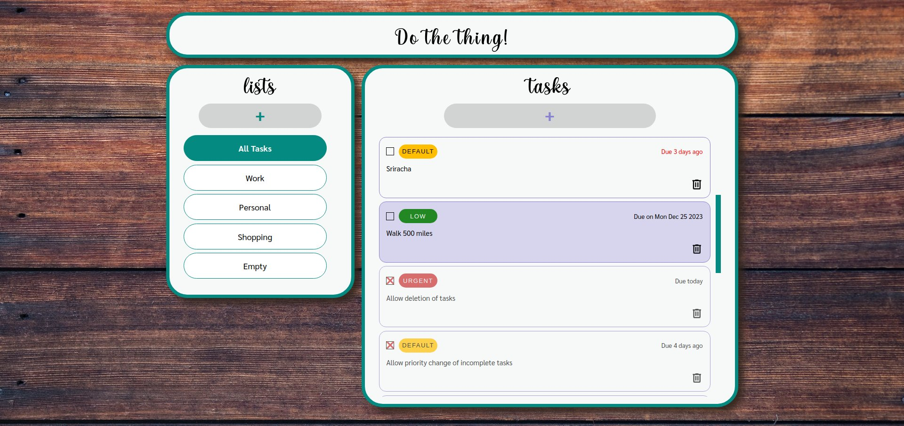
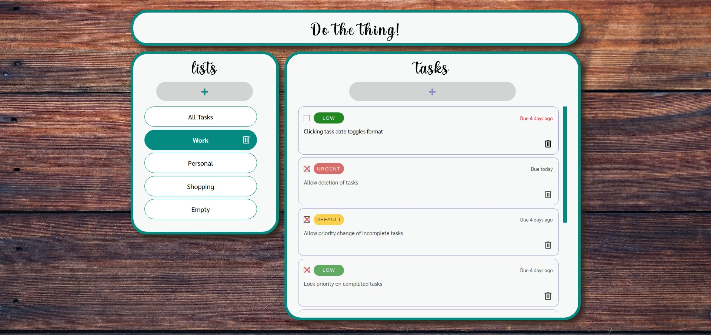
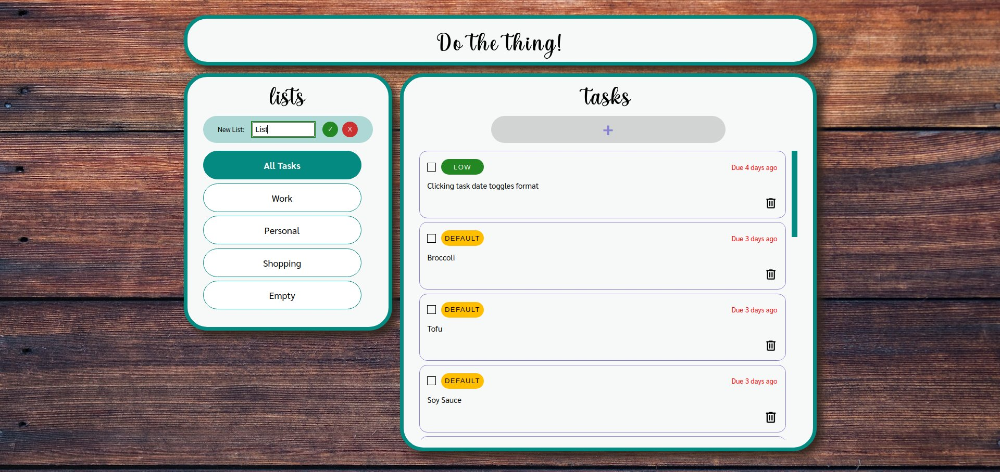
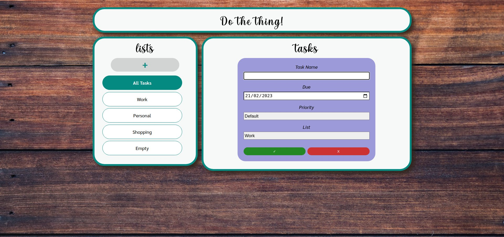
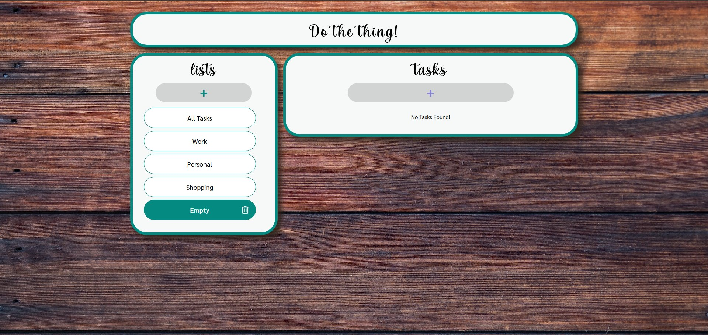

# To-Do List

[See the project live](https://mckensis.github.io/to-do-list)

## About the project

- CRUD style project
- Create a new list or task
- Delete a list or task
- Mark a task as complete
- Change the priority level of a task
- View lists at the top/left (mobile/desktop)
- View tasks at the bottom/right (mobile/desktop)
- Uses localstorage to store user's lists and tasks between sessions

## How to Use

1. Click a list to view its tasks
2. Click the + button in the list or task section to add a new list or task
3. Click the priority level on an individual task to change it.
4. Click the checkbox on a task to mark it as complete.
5. Click the bin icon on the list or task to delete that item.

## Screenshots

## Future Improvements

1. Allow creation of simple lists/tasks which don't need due date/priority. i.e. shopping list.
2. Allow changing of a task's due date.
3. Allow editing of a task title.
4. Allow sorting options for the tasks besides the default.